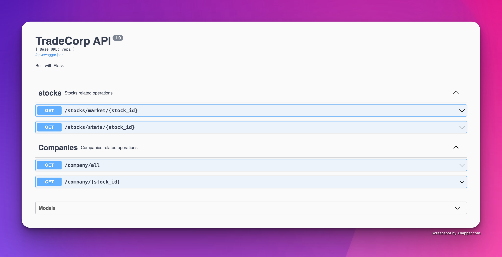
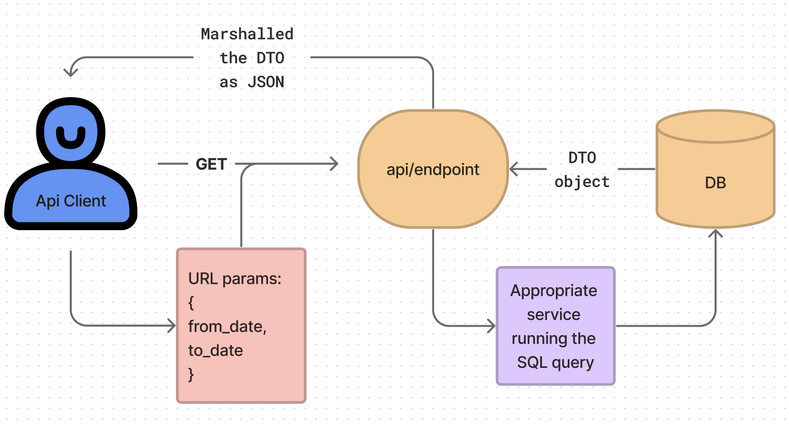

# Setup
- Create a virtual environment and install all the packages using 
```bash
pip3 install -r requirements.txt
```
- Run `make` to setup the DB and run the server
- To re-run the server, run the following command:
```bash
./scripts/run.sh
```
# Design

We have followed a `modular` and `scalable` architecture approach like
`microservices`
and thus divided the whole project into different components, each
serving a specific purpose. Here is the folders organisation :


## Client side *app*

This directory represents the client-side microservice, responsbible for
the user interface and interaction.

-   **Controllers**: Has the modules responsible for handling
    client-side logic, connecting the user interaction to the API, and
    managing the UI.

-   **Static**: Contains the necessary *css, images* and *js* files to
    beautify the HTML templates

-   **Templates**: Raw HTML base files

## Server side *api*

This directory represents the microservice hosting the API endpoints,
and logic for interacting with the Database.

-   **Controllers**: Has the modules hosting different RESTful API
    endpoints.

-   **Services**: Contains the helper functions to interact and operate
    on the database.

-   **Utils**: Contains utilities like Flask Data transfer objects
    (Dto), for communication and data exchange with client processes.

## Database

Contains the csv files of the stock market data, company data, the main
.db database file. Also stores the Flask Models of the tables in the
database and the migration scripts to sync the changes.

## Config

Necessary config files, to setup the server and intializing the Flask
App. Also contains an
[[`ApiClient`]{style="color: codetext"}]{style="background-color: codebackground"}
object, which provides an abstraction layer to the server-api, through
which client can communicate.


# UI/UX

## Flow


## Features

### Technical Filters for stocks

We take the *from_date* and *to_date* input from the user and calculate
the **NGR%** of the stock over that period (net growth rate). We found
this to be a useful metric for stock analysis.
$$\text{NGR(\%)} = \left( \frac{\text{Final closing price} - \text{Initial closing price}}{\text{Initial closing price}} \right) \times 100$$


### Interactive Chart Visualization of Multiple Stock data

We use the [AnyChart](https://docs.anychart.com) javascript charting
library to create an interactive visualization for multiple stock
datasets. AnyChart enables us to dynamically display a wide range of
market data in **Candlestick** and **Line** charts.


### Reset Button

This button resets any selection. All the applied filters and selected
stocks are removed and the stocks table goes back to its original state.

### Show All Button

This button removes all the applied filters and shows all the original
non-selected stocks. The selected stocks are preserved.

## User Experience

We have used modern web development practices to incorporate various
features, and aimed to create a seamless and responsive environment for
the users.

-   **API Client Abstraction** We created an API client to handle all
    communication with our server. This makes it easier to send
    requests, preserving the session and cookies details if required,
    and also keeps our code organized.

-   **Asynchronous Requests without Page Reload** We have used
    *JavaScript* to modify the various elements throughout the webpage,
    without requiring a reload. This means we can make our site respond
    faster and enhance overall experience.

-   **Dynamic Search Bar** Our search bar is designed to be
    user-friendly. As you type, the search results update instantly,
    making it easier to find what you're looking for.

-   **Caching the important data** We've smartly used global variables
    to `cache` the user choices, like selected stocks, even after
    refreshing the page. This practical approach makes sure that users
    can easily continue where they left off without losing their
    preferences.

# API

## Swagger Docs for the Endpoints



## API workflow



## Other things

-   Used `Flask_restx` decorators and wrappers, for easy testing to the
    API and documentation using Swagger.

-   Services are using built-in SQLAlchemy functions to perform the SQL
    queries on the Database, rather raw SQL queries, to avoid attacks
    like SQL Injection. However there is a trade-off as SQL queries are
    more user friendly and customizable.

-   Exception handling is being done at all the endpoints with the
    appropriate messages for a `BadRequest`.

# Database Schema

To avoid data redundancy or duplication, we have majorly two tables in
our database, namely :
`market_data`,
storing the day-wise stock data for nifty50 list and
`company_data`,
storing the company related info for the stock.


## Data

Due to repeated calling to the NSE api using *jugaad-data* library to
pull the latest stock data, it results in errors like timeouts
sometimes. Thus we planned to pull the last 25 years data of the Nifty50
list and store it in the DB. There is an obvious tradeoff, that we loose
the ability to display live or recent data in this design.

## The User Model

We have also created a user table to store the registered users info,
although we are not using it right now but plan to use it in future (See
Section 7). Some things to note:

-   We have set the password attribute as a write-only field using a
    decorator such that if anywhere there is an attempt to read it, it
    will throw an error.

-   Thus to preserve and check the password's authenticity, it is stored
    as a hash.

# Future work

-   We've built the routes for user login and register but we've not
    used these for this subtask since the objective was to just fetch
    and visualize stock data which did not require any user
    personalization.

-   For future work, we intend to use these routes and also use
    **session** module of Flask to create authenticated API endpoints
    too.

-   We intended to build a portfolio for each user showing the stocks
    owned by the user and the order history but this required the **live
    price** of each stock, and due to limited by jugaad-data libraries,
    we thought to drop this idea.
